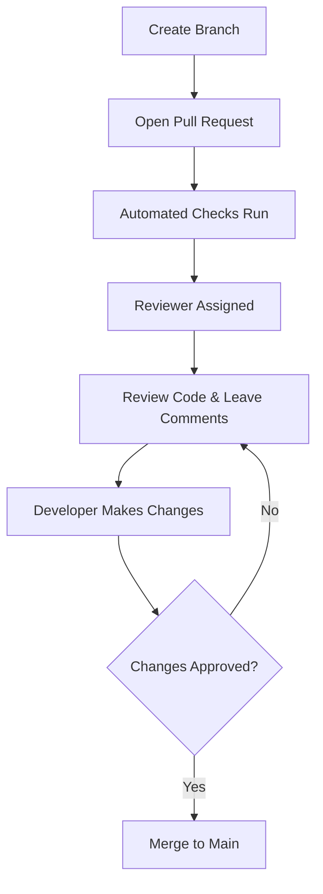

# Software Quality Assurance Team Handbook - Group 10

## Introduction

- Briefly explain the purpose of this handbook
- Mention the startup context
- Say who the document is for
- Explain how the handbook is organised

## Table of Contents

- [Introduction](#introduction)
- [Task Estimation in Scrum](#task-estimation-in-scrum)
- [Code Reviews](#code-reviews)
- [Automated Testing](#automated-testing)
- [Contribution Table](#contribution-table)

---

## Task Estimation in Scrum

### Why This Matters

- One or two sentences on why estimation matters in a startup team

### What Good Estimation Looks Like

- Bullet points with actionable guidelines
- Each bullet backed by findings from our sources
- Clear examples of good team habits

### Common Estimation Traps

- Anti-patterns and bad practices to avoid
- Real examples of what goes wrong
- Common mistakes teams make when estimating

### Key Takeaways

- A diagram or summary visual like an estimation flow
- Planning poker process
- A short recap of the most important points

### Further Reading

- List of sources with one-line descriptions
- Source title — short note on why it is useful
- Source title — short note on what perspective it adds

---

## Code Reviews

### Why This Matters

- Code reviews help catch problems before code is merged and improve the overall quality of the project.
- They also support teamwork by helping developers share knowledge, give useful feedback, and build confidence in the codebase.

### What Good Code Reviews Look Like

- **Keep pull requests small**  
  Smaller pull requests are easier to review properly and make it less likely that bugs or weak design choices will be missed.

- **Give clear, respectful, and constructive feedback**  
  Good comments explain what the issue is, why it matters, and what could be improved. Reviews should focus on the code, not the person, so feedback is easier to accept and more useful.

- **Use reviews as a learning tool**  
  Code reviews are not only for finding mistakes. They also help team members learn from each other and understand more parts of the project.

- **Review code quickly**  
  Feedback should be given soon after the pull request is opened. Fast reviews help the team move forward and stop work from piling up.

- **Set clear review goals**  
  Reviewers should know what they are checking for, such as readability, logic, maintainability, or performance, so the review stays focused.

- **Follow up on issues raised**  
  A review is only useful if the problems found are actually fixed. Teams should make sure there is proper follow-up before the code is merged.

- **Use tools for simple checks**  
  Formatting and style issues can often be checked by automatic tools, giving reviewers more time to focus on deeper issues like logic, structure, and security.

### Common Code Review Traps

- **Reviewing very large changes at once**  
  Large pull requests are harder to review carefully and often lead to rushed feedback or missed issues.

- **Being harsh or personal in comments**  
  Personal criticism can damage teamwork and confidence. Reviews should always discuss the code, not attack the developer.

- **Only saying what is wrong**  
  Feedback without explanation is not very helpful. Review comments should explain why something is a problem and suggest a better direction where possible.

- **Reviewing unfinished work**  
  Reviewing code before it is ready can waste time and lead to incomplete or unclear feedback.

- **Spending too long in one review session**  
  Long review sessions can lead to tiredness and reduced focus. Shorter and more regular reviews are usually more effective.

- **Focusing too much on minor style issues**  
  If too much time is spent on small formatting issues, reviewers may miss bigger problems in the code.

- **Leaving reviews too late**  
  Delayed reviews can slow progress and create a backlog of pull requests waiting for feedback.

- **Using different standards each time**  
  If every reviewer checks for different things, the process becomes inconsistent. A shared checklist can make reviews fairer and more useful.

### Key Takeaways

- Good code reviews should be small, clear, and focused.
- Feedback should be helpful, respectful, and explain the reason behind suggestions.
- Reviews work best when they happen quickly and are followed up properly.
- Teams should use reviews to improve both code quality and shared knowledge.

### Diagram

### Review Checklist

### Functionality

- [ ] Code works as expected
- [ ] Edge cases are handled

#### Readability

- [ ] Code is easy to understand
- [ ] Naming is clear and meaningful

#### Design

- [ ] Structure is clean and maintainable
- [ ] No unnecessary complexity or duplication

#### Testing

- [ ] Tests are included or updated
- [ ] Tests validate behaviour properly

#### Impact

- [ ] No unintended side effects
- [ ] Performance is acceptable

## Further Reading

- Atlassian — *5 Code Review Best Practices*
    - Practical advice on structured and helpful review habits.
    - [https://www.atlassian.com/blog/add-ons/code-review-best-practices](https://www.atlassian.com/blog/add-ons/code-review-best-practices)

- SmartBear — *Best Practices for Peer Code Review*
    - Good for understanding review process, metrics, and team culture.
    - [https://smartbear.com/learn/code-review/best-practices-for-peer-code-review/](https://smartbear.com/learn/code-review/best-practices-for-peer-code-review/)

- GitHub Blog — *How to Review Code Effectively*
    - Focuses on clear comments, quick feedback, and useful reviewer habits.
    - [https://github.blog/developer-skills/github/how-to-review-code-effectively-a-github-staff-engineers-philosophy/](https://github.blog/developer-skills/github/how-to-review-code-effectively-a-github-staff-engineers-philosophy/)

- Mergify — *Code Review: Culture, Flow, and Practices That Drive Team Performance*
    - Helpful for the teamwork and knowledge-sharing side of reviews.
    - [https://mergify.com/blog/code-review-culture-flow-and-practices-that-drive-team-performance](https://mergify.com/blog/code-review-culture-flow-and-practices-that-drive-team-performance)

- Google Engineering Practices — *The Standard of Code Review*
    - Strong source for review standards and improving code health over time.
    - [https://google.github.io/eng-practices/review/reviewer/](https://google.github.io/eng-practices/review/reviewer/)

- YouTube — *Better Code Reviews in 6 Simple Steps*
    - Simple and practical tips on keeping reviews focused and useful.
    - [https://www.youtube.com/watch?v=d9_fweNDjKw](https://www.youtube.com/watch?v=d9_fweNDjKw)

- Parasoft — *Eliminate These 7 Bad Habits for More Effective Peer Code Reviews*
    - Useful for spotting common mistakes and anti-patterns in review culture.
    - [https://www.parasoft.com/blog/avoid-ineffective-code-reviews-by-eliminating-these-7-bad-habits/](https://www.parasoft.com/blog/avoid-ineffective-code-reviews-by-eliminating-these-7-bad-habits/)

---

## Automated Testing

### Why This Matters

- One or two sentences on why automated testing matters in a startup environment

### What Good Automated Testing Looks Like

- Bullet points with actionable guidelines
- Each bullet backed by findings from our sources
- Clear examples of practical testing habits

### Common Testing Traps

- Anti-patterns and bad practices to avoid
- Real examples of what goes wrong
- Common mistakes teams make when building test suites

### Key Takeaways

- A diagram or summary visual like a testing pyramid
- Coverage vs confidence visual
- A short recap of the most important points

### Further Reading

- List of sources with one-line descriptions
- Source title — short note on why it is useful
- Source title — short note on what perspective it adds

---

## Contribution Table

| Team Member | Contribution | Verified By |
|---|---|---|
| Stela |  |  |
| John |  |  |
| Callum |  |  |
