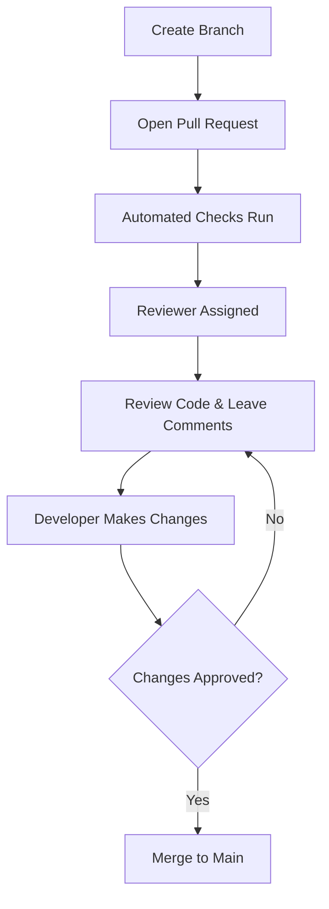
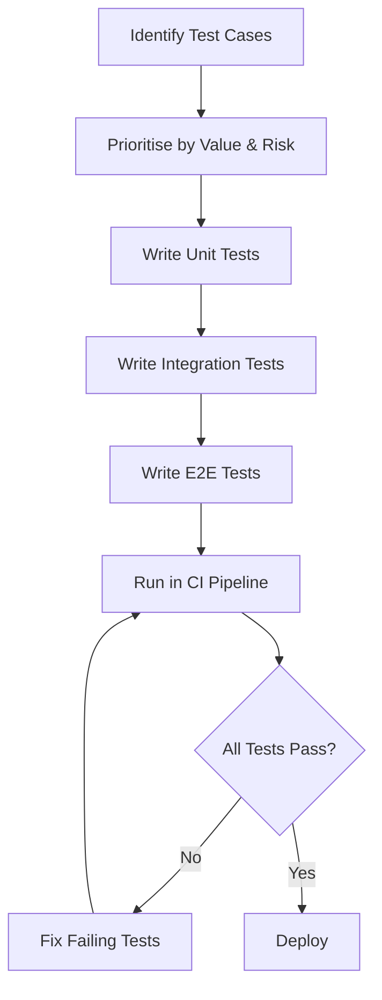

# Software Quality Assurance Team Handbook - Group 10

## Introduction

This handbook explains the main ways we aim to maintain quality in our project. Its purpose is to give us a clear and practical guide to the ways of working we want to follow as a team, so that expectations are clearly defined and good practises are surfaced.

The handbook is divided into three main sections:

- **Task Estimation in Scrum** - how we estimate work in a consistent way so that planning is more realistic and uncertainty is reduced.
- **Code Reviews** - how we review each other’s work to improve code quality, share knowledge and catch issues early.
- **Automated Testing** - how we build and maintain tests that are reliable, clear and useful.

Each section includes a short introduction, the main good practices to follow, bad practices to avoid and links to further reading.

## Table of Contents

- [Introduction](#introduction)
- [Task Estimation in Scrum](#task-estimation-in-scrum)
- [Code Reviews](#code-reviews)
- [Automated Testing](#automated-testing)
- [Contribution Table](#contribution-table)

---

## Task Estimation in Scrum

### Why This Matters

- Estimation is how a Scrum team figures out what fits in a sprint and when something might actually ship. If you mess this up, people either burn out chasing unrealistic targets or sit idle because nobody committed to enough work.
- When you've got 20 engineers and no room for wasted sprints, getting this wrong costs money.

### What Good Estimation Looks Like

- **Why not hours? Because your hour isn't the same as mine**

  Ask two developers how long a task will take and you'll get two different answers. That's not a problem with the developers. They just bring different skills and experience. But ask both of them whether task A is roughly twice as hard as task B, and they'll probably agree. That agreement on relative effort is what story points capture. Jeff Sutherland, co-author of the Scrum Guide, called them "faster, better and cheaper than hours" because they avoid time-based bias entirely.

- **Anchor your scale with real stories**

  Find a story everyone thinks is small and call it a 2. Find one that feels about twice the effort and call it a 5. Now you've got anchors. Every future estimate gets compared against these two, which stops the scale from drifting as sprints go by and gives new team members something concrete to point at.

- **Three things push an estimate up**

  Amount of work, complexity and risk. A task might be straightforward but large. Another might be small but involve crossing a tricky integration boundary. A third might depend on an external API nobody has touched before. When any of these are present, the number should go up.

- **Planning poker works because of the arguments**

  Everyone picks a number independently, then reveals at the same time. If the estimates match, move on. When they don't (say one person votes 2 and another votes 8), that gap is the whole point. The discussion usually finds unclear requirements or assumptions only one person was making. Five to ten minutes of that conversation is worth more than an hour of solo guessing.

- **Velocity needs time to mean anything**

  Velocity (points shipped per sprint) only tells you something useful after several iterations. Promising delivery dates off two sprints of data is guesswork dressed up as planning. Wait until you have a stable average across at least five sprints, then express forecasts as a range (e.g. 30 to 50 points). Never a single number.

- **Why the numbers look weird**

  Teams use scales like 1, 2, 3, 5, 8, 13, 20 because humans can't reliably tell the difference between, say, 19 and 21. But they can tell 13 from 20. Psychologists call this Weber's Law. The Fibonacci sequence bakes this in by keeping gaps just wide enough to be meaningful. A story estimated at 21 looks worryingly precise to stakeholders. Calling it 20 avoids that false impression.

- **Check your past estimates, not just your future ones**

  Pull up the last batch of stories estimated as 5 points. Did they all feel like similar effort? If not, figure out why. This is how teams build a shared sense of what each number actually means. Most teams skip this step entirely. The ones that don't get noticeably better at forecasting within a few iterations.

### Common Estimation Traps

- **Converting story points back to hours**

  This defeats the entire purpose. The moment a manager says "so an 8 is about two days, right?", the team is back to time-based thinking and all the bias that comes with it.

- **Letting one or two people estimate for the team**

  Estimation works because it forces the whole team to think about the work. When only the tech lead estimates, everyone else loses context and commitment to what was planned.

- **Obsessing over the exact number**

  Estimation is a rough band, not a contract. Two days of sprint planning for a two week sprint? Something has gone wrong. If the team has stable velocity, the exact number on any individual story matters far less than the overall average across many stories.

- **Skipping the split conversation**

  If the team can't agree on a story's size, that almost always means it's too big or too vague. Wide disagreement is a signal to split the story, run a spike or go back to the product owner for clearer acceptance criteria.

- **Never looking back at what you got wrong**

  Teams that skip retros keep making the same mistakes. A quick look at which stories were over or underestimated teaches you more than any estimation framework ever will.

- **Treating story points as the only option**

  They're popular, but some mature teams move to flow metrics (cycle time, throughput) or drop estimation entirely. If your method isn't helping the team plan better, try something else.

### Key Takeaways

- Estimation is a team alignment tool, not a way to make precise schedules.
- Story points work because they measure relative effort and remove individual skill bias.
- Disagreements during planning poker are features, not bugs. They surface hidden risk.
- Velocity only becomes useful after several sprints of data. Don't promise off early numbers.
- Look back at what you got wrong. That's where the real improvement comes from.

### Diagram

### Further Reading

- Scrum.org: *Why do we use Story Points for Estimating?*
    - Explains why story points beat hours and why divergent votes are a useful signal.
    - [https://www.scrum.org/resources/blog/why-do-we-use-story-points-estimating](https://www.scrum.org/resources/blog/why-do-we-use-story-points-estimating)

- Mountain Goat Software: *Agile Estimating: How Teams Estimate with Story Points*
    - Covers baseline stories, planning poker, the three factors of effort and the modified Fibonacci scale.
    - [https://www.mountaingoatsoftware.com/agile/agile-estimation-estimating-with-story-points](https://www.mountaingoatsoftware.com/agile/agile-estimation-estimating-with-story-points)

- Scrum Alliance: *A Cure for Task Estimation Obsession*
    - Makes the case for dropping task-level estimation once a team has stable velocity.
    - [https://resources.scrumalliance.org/Article/cure-task-estimation-obsession](https://resources.scrumalliance.org/Article/cure-task-estimation-obsession)

- Agile Alliance: *Improving Estimation with Story Points*
    - Experience report from a first-time agile team showing how calibration improved over time.
    - [https://agilealliance.org/resources/experience-reports/improving-estimation-story-points/](https://agilealliance.org/resources/experience-reports/improving-estimation-story-points/)

- Atlassian: *Agile Estimation*
    - Practical guide to story point estimation, splitting stories and using planning poker.
    - [https://www.atlassian.com/agile/project-management/estimation](https://www.atlassian.com/agile/project-management/estimation)

- Scrum.org: *Exploring Estimation Approaches*
    - Compares story points, hourly estimates, flow metrics and no-estimation approaches.
    - [https://www.scrum.org/resources/blog/exploring-estimation-approaches-what-right-fit-scrum-teams](https://www.scrum.org/resources/blog/exploring-estimation-approaches-what-right-fit-scrum-teams)

- Beyond Lean Agile: *Metrics*
    - Covers velocity, cycle time and how metrics should guide useful discussion rather than become a distraction.
    - [https://beyondleanagile.com/tag/metrics/](https://beyondleanagile.com/tag/metrics/)

---

## Code Reviews

### Why This Matters

- Code reviews help catch problems before code is merged and improve the overall quality of the project.
- They also support teamwork by helping developers share knowledge, give useful feedback, and build confidence in the codebase.

### What Good Code Reviews Look Like

- **Keep pull requests small**  
  Smaller pull requests are easier to review properly and make it less likely that bugs or weak design choices will be missed.

- **Give clear, respectful, and constructive feedback**  
  Good comments explain what the issue is, why it matters, and what could be improved. Reviews should focus on the code, not the person, so feedback is easier to accept and more useful.

- **Use reviews as a learning tool**  
  Code reviews are not only for finding mistakes. They also help team members learn from each other and understand more parts of the project.

- **Review code quickly**  
  Feedback should be given soon after the pull request is opened. Fast reviews help the team move forward and stop work from piling up.

- **Set clear review goals**  
  Reviewers should know what they are checking for, such as readability, logic, maintainability, or performance, so the review stays focused.

- **Follow up on issues raised**  
  A review is only useful if the problems found are actually fixed. Teams should make sure there is proper follow-up before the code is merged.

- **Use tools for simple checks**  
  Formatting and style issues can often be checked by automatic tools, giving reviewers more time to focus on deeper issues like logic, structure, and security.

### Common Code Review Traps

- **Reviewing very large changes at once**  
  Large pull requests are harder to review carefully and often lead to rushed feedback or missed issues.

- **Being harsh or personal in comments**  
  Personal criticism can damage teamwork and confidence. Reviews should always discuss the code, not attack the developer.

- **Only saying what is wrong**  
  Feedback without explanation is not very helpful. Review comments should explain why something is a problem and suggest a better direction where possible.

- **Reviewing unfinished work**  
  Reviewing code before it is ready can waste time and lead to incomplete or unclear feedback.

- **Spending too long in one review session**  
  Long review sessions can lead to tiredness and reduced focus. Shorter and more regular reviews are usually more effective.

- **Focusing too much on minor style issues**  
  If too much time is spent on small formatting issues, reviewers may miss bigger problems in the code.

- **Leaving reviews too late**  
  Delayed reviews can slow progress and create a backlog of pull requests waiting for feedback.

- **Using different standards each time**  
  If every reviewer checks for different things, the process becomes inconsistent. A shared checklist can make reviews fairer and more useful.

### Key Takeaways

- Good code reviews should be small, clear, and focused.
- Feedback should be helpful, respectful, and explain the reason behind suggestions.
- Reviews work best when they happen quickly and are followed up properly.
- Teams should use reviews to improve both code quality and shared knowledge.

### Diagram

### Review Checklist

### Functionality

- [ ] Code works as expected
- [ ] Edge cases are handled

#### Readability

- [ ] Code is easy to understand
- [ ] Naming is clear and meaningful

#### Design

- [ ] Structure is clean and maintainable
- [ ] No unnecessary complexity or duplication

#### Testing

- [ ] Tests are included or updated
- [ ] Tests validate behaviour properly

#### Impact

- [ ] No unintended side effects
- [ ] Performance is acceptable

## Further Reading

- Atlassian — *5 Code Review Best Practices*
    - Practical advice on structured and helpful review habits.
    - [https://www.atlassian.com/blog/add-ons/code-review-best-practices](https://www.atlassian.com/blog/add-ons/code-review-best-practices)

- SmartBear — *Best Practices for Peer Code Review*
    - Good for understanding review process, metrics, and team culture.
    - [https://smartbear.com/learn/code-review/best-practices-for-peer-code-review/](https://smartbear.com/learn/code-review/best-practices-for-peer-code-review/)

- GitHub Blog — *How to Review Code Effectively*
    - Focuses on clear comments, quick feedback, and useful reviewer habits.
    - [https://github.blog/developer-skills/github/how-to-review-code-effectively-a-github-staff-engineers-philosophy/](https://github.blog/developer-skills/github/how-to-review-code-effectively-a-github-staff-engineers-philosophy/)

- Mergify — *Code Review: Culture, Flow, and Practices That Drive Team Performance*
    - Helpful for the teamwork and knowledge-sharing side of reviews.
    - [https://mergify.com/blog/code-review-culture-flow-and-practices-that-drive-team-performance](https://mergify.com/blog/code-review-culture-flow-and-practices-that-drive-team-performance)

- Google Engineering Practices — *The Standard of Code Review*
    - Strong source for review standards and improving code health over time.
    - [https://google.github.io/eng-practices/review/reviewer/](https://google.github.io/eng-practices/review/reviewer/)

- YouTube — *Better Code Reviews in 6 Simple Steps*
    - Simple and practical tips on keeping reviews focused and useful.
    - [https://www.youtube.com/watch?v=d9_fweNDjKw](https://www.youtube.com/watch?v=d9_fweNDjKw)

- Parasoft — *Eliminate These 7 Bad Habits for More Effective Peer Code Reviews*
    - Useful for spotting common mistakes and anti-patterns in review culture.
    - [https://www.parasoft.com/blog/avoid-ineffective-code-reviews-by-eliminating-these-7-bad-habits/](https://www.parasoft.com/blog/avoid-ineffective-code-reviews-by-eliminating-these-7-bad-habits/)

---

## Automated Testing

### Why This Matters

- Automated testing helps us catch bugs quickly without having to manually check everything after each change.
- It gives developers confidence to make updates without breaking existing features.
- This allows us to work faster while keeping the system stable.

### What Good Automated Testing Looks Like

- Start with a clear testing strategy
    - Define what should be automated and why, rather than automating everything blindly. Focus on high-value and frequently used features.
- Keep tests small, modular, and focused
    - Each test should cover one behaviour only. This makes failures easier to understand and fix.
- Organise tests clearly
    - Group tests by feature or functionality (e.g. login, payments). This improves navigation and maintainability.
- Write readable and maintainable test code
    - Use clear naming, simple structure, and avoid complexity so other developers can understand tests easily.
- Avoid code duplication
    - Reuse helper methods and shared components to keep the test suite clean and scalable.
- Design tests for the future
    - Avoid hardcoded values and write flexible tests that can handle changes in the system.
- Prevent flaky tests
    - Ensure tests are stable by running tests repeatedly and avoiding unreliable dependencies (e.g. timing issues or unstable UI elements).
- Use API-level testing where possible
    - API tests are faster and more reliable than UI tests, reducing overall test execution time.
- Document tests and expected outcomes clearly
    - Good documentation helps debugging and allows new team members to understand the system faster.
- Align testing with team skills
    - Assign testing tasks based on experience levels to maintain quality and efficiency.
- Define expected results before writing tests
    - Clearly outlining what a test should do makes it easier to validate behaviour and reduces confusion when debugging.
- Use logging to support debugging
    - Logging helps identify where failures occur and speeds up troubleshooting.
- Follow object-oriented design where possible
    - Using patterns like page objects and shared components helps organise tests and improves maintainability.
- Keep tests platform independent
    - Tests should not rely on a specific environment so they can run consistently across different systems.
- Test at the lowest level possible
    - If something can be tested with a unit or API test, it should not be pushed up to a UI test. Lower-level tests are usually quicker and less flaky.
- Use integration tests carefully
    - Integration tests are useful for checking boundaries such as database writes or API calls, but they should be used in a focused way rather than replacing unit tests.
- Strengthen lower-level tests when bugs are found
    - If a bug is discovered in a high-level test, add a lower-level test for it as well so the issue can be caught earlier next time.
- Encourage shared ownership of testing
    - Developers and testers should work together on test strategy so that quality is built into the process rather than passed between separate teams.

### Common Testing Traps

- Trying to automate everything
    - Not all tests should be automated. Low-value or rarely used features can waste time and effort.
- Overly complex tests
    - Large, complicated tests are hard to debug and maintain.
- Hardcoded data in tests
    - This makes tests brittle and prone to breaking when data changes.
- Poor organisation of test files
    - Leads to confusion, duplication, and difficulty maintaining the test suite.
- Lack of documentation
    - Makes it harder for new developers to understand what tests are doing or why they exist.
- Ignoring test maintenance
    - Outdated or broken tests pile up and slow down development.
- Duplicated test logic
    - Increases maintenance effort and creates inconsistencies.
- Not defining expected outcomes clearly
    - Without clear expected results, it becomes difficult to know if a test is actually passing or failing correctly.
- Overusing comments instead of clear code
    - If tests require heavy commenting, it often means the code is not clear enough on its own.
- Not integrating testing into development culture
    - Treating testing as a separate activity rather than part of development leads to weaker overall quality.
- Duplicating the same test coverage across different levels
    - Testing the same behaviour repeatedly at unit, integration, and UI level wastes time and increases maintenance work.
- Relying too heavily on UI or end-to-end tests
    - Too many high-level tests can make the suite slow, expensive to maintain, and more likely to fail for unrelated reasons.

### Key Takeaways

- Automated testing should be strategic, not excessive
- Tests must be stable, readable, and maintainable by using a clear structure and organisation.
- Avoid flaky tests
- Focus on long-term scalability, not just short-term success
- Good testing is part of team culture, not just a QA task
- Good test data and tool selection are critical for reliable testing
- Tests should be simple, modular, and easy to understand
- Automation should be built into the development process, not treated as an afterthought
- A balanced test suite should follow the testing pyramid
- Avoid top-heavy anti-patterns like the ice cream cone or testing cupcake
- Testing works best when the whole team shares responsibility for quality

### Further Reading

- 14 Test Automation Best Practices
    - [https://medium.com/jagaad/14-test-automation-best-practices-ffd56880f20e](https://medium.com/jagaad/14-test-automation-best-practices-ffd56880f20e)
- Test Automation Best Practices
    - [https://smartbear.com/learn/automated-testing/best-practices-for-automation/](https://smartbear.com/learn/automated-testing/best-practices-for-automation/)
- Best Practices For Writing Automation Test Code
    - [https://dev.to/sureshayyanna/best-practices-for-writingautomation-test-code-1laa](https://dev.to/sureshayyanna/best-practices-for-writingautomation-test-code-1laa)
- Automation Testing Best Practices
    - [https://www.reddit.com/r/softwaretesting/comments/1bhpiaj/automation_testing_best_practices/](https://www.reddit.com/r/softwaretesting/comments/1bhpiaj/automation_testing_best_practices/)
- Best Practices for Test Automation: Checklist
    - [https://www.browserstack.com/guide/test-automation-standards-and-checklist](https://www.browserstack.com/guide/test-automation-standards-and-checklist)
- The Practical Test Pyramid
    - [https://martinfowler.com/articles/practical-test-pyramid.html](https://martinfowler.com/articles/practical-test-pyramid.html)
- Introducing the Software Testing Cupcake (Anti-Pattern)
    - [https://www.thoughtworks.com/insights/blog/introducing-software-testing-cupcake-anti-pattern](https://www.thoughtworks.com/insights/blog/introducing-software-testing-cupcake-anti-pattern)

### Diagram

### Testing Checklist

#### Test Design

- [ ] Each test covers a single behaviour
- [ ] Tests have clear, descriptive names
- [ ] Expected results are defined before writing the test

#### Test Quality

- [ ] No hardcoded data in test code
- [ ] Tests are not flaky or timing dependent
- [ ] No duplicated test logic

#### Maintainability

- [ ] Tests are grouped by feature or functionality
- [ ] Helper methods are used for repeated tasks
- [ ] Test code is readable without heavy commenting

#### Coverage

- [ ] Tests follow the testing pyramid (most unit, fewer integration, fewest E2E)
- [ ] Bugs found at higher levels are covered by lower level tests
- [ ] API level tests are used where possible over UI tests

---

## Contribution Table

| Team Member | Contribution                                                                                                                                                                                                                                                                                                                                                                               | Verified By |
|---|--------------------------------------------------------------------------------------------------------------------------------------------------------------------------------------------------------------------------------------------------------------------------------------------------------------------------------------------------------------------------------------------|---|
| John | - Set up the initial repo structure, sections, and project files - Added markdownlint pre-commit hook and fixed linting issues across the project - Researched 5 sources for Task Estimation in Scrum - Researched 2 extra sources for Automated Testing - Wrote the Task Estimation in Scrum section - Created diagram and checklist for the Automated Testing section     | Stela, Callum |
| Stela | - Created the team handbook skeleton - Wrote the handbook introduction - Researched 5 sources for Code Reviews - Wrote the Code Reviews section - Assembled the Code Reviews section into the handbook - Researched 2 extra sources for Task Estimation - Found the story points diagram for Task Estimation - Reformatted titles and subheadings across the handbook | John, Callum |
| Callum | - Created research templates for all topics - Researched 5 sources for Automated Testing - Researched extra sources for Code Reviews - Wrote the first draft of the Automated Testing section - Created diagram and checklist for the Code Reviews section - Assembled the full handbook from individual sections                                                           | John, Stela |
