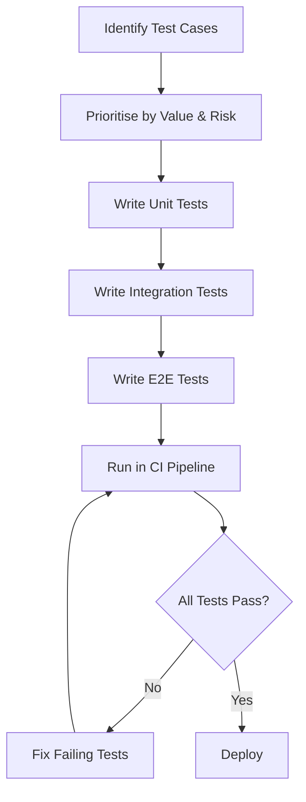

# Automated Testing

## Why This Matters

- Automated testing helps us catch bugs quickly without having to manually check everything after each change.
- It gives developers confidence to make updates without breaking existing features.
- This allows us to work faster while keeping the system stable.

## What Good Automated Testing Looks Like

- Start with a clear testing strategy
    - Define what should be automated and why, rather than automating everything blindly. Focus on high-value and frequently used features.
- Keep tests small, modular, and focused
    - Each test should cover one behaviour only. This makes failures easier to understand and fix.
- Organise tests clearly
    - Group tests by feature or functionality (e.g. login, payments). This improves navigation and maintainability.
- Write readable and maintainable test code
    - Use clear naming, simple structure, and avoid complexity so other developers can understand tests easily.
- Avoid code duplication
    - Reuse helper methods and shared components to keep the test suite clean and scalable.
- Design tests for the future
    - Avoid hardcoded values and write flexible tests that can handle changes in the system.
- Prevent flaky tests
    - Ensure tests are stable by running tests repeatedly and avoiding unreliable dependencies (e.g. timing issues or unstable UI elements).
- Use API-level testing where possible
    - API tests are faster and more reliable than UI tests, reducing overall test execution time.
- Document tests and expected outcomes clearly
    - Good documentation helps debugging and allows new team members to understand the system faster.
- Align testing with team skills
    - Assign testing tasks based on experience levels to maintain quality and efficiency.
- Define expected results before writing tests
    - Clearly outlining what a test should do makes it easier to validate behaviour and reduces confusion when debugging.
- Use logging to support debugging
    - Logging helps identify where failures occur and speeds up troubleshooting.
- Follow object-oriented design where possible
    - Using patterns like page objects and shared components helps organise tests and improves maintainability.
- Keep tests platform independent
    - Tests should not rely on a specific environment so they can run consistently across different systems.
- Test at the lowest level possible
    - If something can be tested with a unit or API test, it should not be pushed up to a UI test. Lower-level tests are usually quicker and less flaky.
- Use integration tests carefully
    - Integration tests are useful for checking boundaries such as database writes or API calls, but they should be used in a focused way rather than replacing unit tests.
- Strengthen lower-level tests when bugs are found
    - If a bug is discovered in a high-level test, add a lower-level test for it as well so the issue can be caught earlier next time.
- Encourage shared ownership of testing
    - Developers and testers should work together on test strategy so that quality is built into the process rather than passed between separate teams.
  
## Common Testing Traps

- Trying to automate everything
    - Not all tests should be automated. Low-value or rarely used features can waste time and effort.
- Overly complex tests
    - Large, complicated tests are hard to debug and maintain.
- Hardcoded data in tests
    - This makes tests brittle and prone to breaking when data changes.
- Poor organisation of test files
    - Leads to confusion, duplication, and difficulty maintaining the test suite.
- Lack of documentation
    - Makes it harder for new developers to understand what tests are doing or why they exist.
- Ignoring test maintenance
    - Outdated or broken tests pile up and slow down development.
- Duplicated test logic
    - Increases maintenance effort and creates inconsistencies.
- Not defining expected outcomes clearly
    - Without clear expected results, it becomes difficult to know if a test is actually passing or failing correctly.
- Overusing comments instead of clear code
    - If tests require heavy commenting, it often means the code is not clear enough on its own.
- Not integrating testing into development culture
    - Treating testing as a separate activity rather than part of development leads to weaker overall quality.
- Duplicating the same test coverage across different levels
    - Testing the same behaviour repeatedly at unit, integration, and UI level wastes time and increases maintenance work.
- Relying too heavily on UI or end-to-end tests
    - Too many high-level tests can make the suite slow, expensive to maintain, and more likely to fail for unrelated reasons.

## Key Takeaways

- Automated testing should be strategic, not excessive
- Tests must be stable, readable, and maintainable by using a clear structure and organisation.
- Avoid flaky tests
- Focus on long-term scalability, not just short-term success
- Good testing is part of team culture, not just a QA task
- Good test data and tool selection are critical for reliable testing
- Tests should be simple, modular, and easy to understand
- Automation should be built into the development process, not treated as an afterthought
- A balanced test suite should follow the testing pyramid
- Avoid top-heavy anti-patterns like the ice cream cone or testing cupcake
- Testing works best when the whole team shares responsibility for quality

## Further Reading

- 14 Test Automation Best Practices
    - [https://medium.com/jagaad/14-test-automation-best-practices-ffd56880f20e](https://medium.com/jagaad/14-test-automation-best-practices-ffd56880f20e)
- Test Automation Best Practices
    - [https://smartbear.com/learn/automated-testing/best-practices-for-automation/](https://smartbear.com/learn/automated-testing/best-practices-for-automation/)
- Best Practices For Writing Automation Test Code
    - [https://dev.to/sureshayyanna/best-practices-for-writingautomation-test-code-1laa](https://dev.to/sureshayyanna/best-practices-for-writingautomation-test-code-1laa)
- Automation Testing Best Practices
    - [https://www.reddit.com/r/softwaretesting/comments/1bhpiaj/automation_testing_best_practices/](https://www.reddit.com/r/softwaretesting/comments/1bhpiaj/automation_testing_best_practices/)
- Best Practices for Test Automation: Checklist
    - [https://www.browserstack.com/guide/test-automation-standards-and-checklist](https://www.browserstack.com/guide/test-automation-standards-and-checklist)
- The Practical Test Pyramid
    - [https://martinfowler.com/articles/practical-test-pyramid.html](https://martinfowler.com/articles/practical-test-pyramid.html)
- Introducing the Software Testing Cupcake (Anti-Pattern)
    - [https://www.thoughtworks.com/insights/blog/introducing-software-testing-cupcake-anti-pattern](https://www.thoughtworks.com/insights/blog/introducing-software-testing-cupcake-anti-pattern)
  
## Diagram

### Testing Checklist

#### Test Design

- [ ] Each test covers a single behaviour
- [ ] Tests have clear, descriptive names
- [ ] Expected results are defined before writing the test

#### Test Quality

- [ ] No hardcoded data in test code
- [ ] Tests are not flaky or timing dependent
- [ ] No duplicated test logic

#### Maintainability

- [ ] Tests are grouped by feature or functionality
- [ ] Helper methods are used for repeated tasks
- [ ] Test code is readable without heavy commenting

#### Coverage

- [ ] Tests follow the testing pyramid (most unit, fewer integration, fewest E2E)
- [ ] Bugs found at higher levels are covered by lower level tests
- [ ] API level tests are used where possible over UI tests
